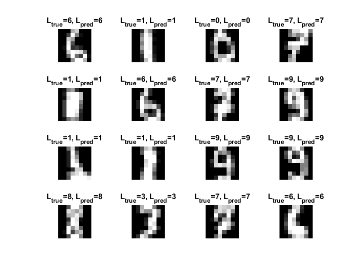
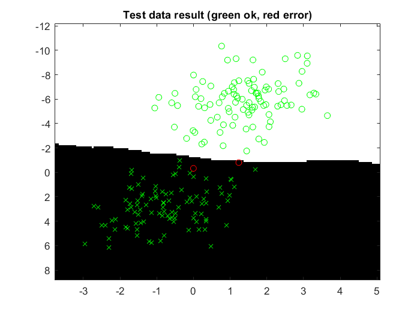

```{r setup, include=FALSE}
knitr::opts_chunk$set(echo = TRUE)
```

# A1_Supervised

**1.	Give an overview of the four datasets from a machine learning perspective. Consider if you need linear or non-linear classifiers etc.**

**DataSet 1 :**

This data set has 2 features/columns which belong to 2 different classes. 

As displayed in the below figure there are data points belonging to 2 classes (in green and red) and are overlapping on each other at some points, therefore it cannot be separable using a line or hyperplane and also not by  a non-linear classifier. 

```{r D1,echo=FALSE,out.width="49%", out.height="49%",fig.align='center'}

```

**DataSet 2 :**

This data set has 2 features/columns which belong to 2 different classes. 

As displayed in the below figure there are data points belonging to 2 classes (in green and red). The orientation of data points are such that a line or hyperplane would not give a good result. Hence a non-linear classifier is needed to classify these data points.

```{r D2,echo=FALSE,out.width="49%", out.height="49%",fig.align='center'}

```

**DataSet 3 :**

This data set has 3 features/columns which belong to 3 different classes. 

As displayed in the below figure there are data points belonging to 3 classes (in green, red and blue). The orientation of data points are such that a linear classifier would not give a good result - Observing the green points and Red data points, these  points are having some non linear orientation where a single linear discrimination could not classify all the points correctly. Hence a non-linear classifier is needed to classify these data points.


```{r D3,echo=FALSE,out.width="49%", out.height="49%",fig.align='center'}

```

**Data-Set 4 :**

This data set has 64 features/columns which belong to 10 different classes. 

These data points are the pixel values, its hard to visualize in 2 dimensional space. However, by analyzing the data its observed that data points are having the overlaps, which cannot be separated with line or hyperplane. Hence a non linear classifier to be used for classification.


```{r D4,echo=FALSE,out.width="49%", out.height="49%",fig.align='center'}

```

**2.	Explain why the down sampling of the OCR data (done as pre-processing) result in a more robust feature representation. See (http://archive.ics.uci.edu/ml/datasets/Optical+Recognition+of+Handwritten+Digits)**

OCR dataset is the normalized bitmaps of handwritten digits. Down sampling means down scaling the resolution of the image. This process reduces the image size, reduces the dimensionality by removing some information (removes some rows and columns). This gives more variability in the data that makes the model more robust to the new data.

**3.	Give a short summary of how you implemented the kNN algorithm.**

Implementation of K-NNN algorithm consisted of following steps:

 
1. Loading the data
2. Initializing the K to a chosen number of neighbors.
3. Calculating the Euclidean Distance between the known data point and a new observation.
$\sqrt{\sum_{feature-1}^{feature-n}{(Xnew_{i}-Xknown_{i})^2}}$
4. Order the distances in ascending order. 
5. Based on the number of neighbors chosen, select the nearest distances.
6. Map the indices of distances obtained in the step 5 with the indices of true label.
7. Select the label which has occurred maximum times (Majority voting).
8. Repeat these steps for all the features.

**4.	Explain how you handle draws in kNN, e.g. with two classes (k = 2)?**

In our code, after taking the majority voting if both class have equal vote we ware considering the first class in the vector. Another approach would be, when multiple classes get same  vote, we could shuffle the order of the indices in the final vector randomly and select the class in this first place (This approach we have not implemented).

**5.	Explain how you selected the best k for each dataset using cross validation. Include the accuracy and images of your results for each dataset.**

Selection of best K involves following steps:

1. We initialize the a vector with k values ranging from 1 to desired number of k.
2. Run the cross validation algorithm  for n fold (in our case n = 5)
3. For every iteration sum the accuracy obtained by running the model with validation set.
4. Store the summed accuracy after completion of all the folds for a particular value of k.
5. Repeat step 3 and 4 for all the values of k in the vector generated in 1st step.
6. After completion fo step 5, take average of accuracies (by dividing with number of folds).
7. Select the index that gives the max accuracy and the index will be the optimal k value.

Note: Since its expected that the model would give best results at k = 1 also, the model will be highly overfitted and model will be highly complex. Hence we are ignoring k = 1 and considering the highest k value that has higher accuracy. 

**Dataset 1:**

**optimal k:** 20

**Accuracy:** 99%

```{r fig2,echo=FALSE,out.width="49%", out.height="49%",fig.align='center'}

```

**Dataset 2:**

**optimal k:** 2

**Accuracy:** 100%

```{r fig3,echo=FALSE,out.width="49%", out.height="49%",fig.align='center'}

```
**Dataset 3:**

**optimal k:**11

**Accuracy:** 99.00%

```{r fig4,echo=FALSE,out.width="49%", out.height="49%",fig.align='center'}

```

**Dataset 4:**

**optimal k:** 3

**Accuracy:** 97.33%

```{r echo=FALSE,out.width="49%", out.height="49%",fig.align='center'}

```

**6.	Give a short summary of your backprop implementations (single + multi). You do not need to derive the update rules.**

Backpropagation in *Single Layer* Neural Network:

OPtimal weights are to be updated using backpropagation technique using gradient descent optimization.

c1. Considering input data of dimension [n,i]
c2. Considering there are j classes

then the weight should be of dimension [i,j]. 

With this understanding, initial weights (W0) is updated using random number generator function.

Using forward propagation, errors have been calculated using the Mean Square Error formula.

gradient is calculated using the formula:

$grad = 2/NTrain * t(XTrain) * (PredTrain - DTrain)$ *NTrain = # of Training Points*

using the gradient calculate get the new weight using gradient descent algorithm.

Backpropagation in *Multi Layer* Neural Network:

Similar to single layer Network, in MultiLayer (In our case 2 layer NN).

Since 2 layer network, 2 weights are considered: 1 at input layer and 2nd one for the 2nd layer.

Weight at input layer, W0 is initialized using random number generator and is of dimension [i,j] here j = number of hidden unites in the 1st layer.

Weight at the 2nd layer, V0 is initialized similar as W0, but its dimension will be [j+1,k]. Where j = number of hidden units +1 ( additional unit is for the bias at input layer) and k = number of classes.

In addition, in the forward propagation logic, need to add additional bias at the 2nd layer.

optimal weights are calculated using gradient descent.

$grad_w = 2/NTrain * t(C) * (PredTrain - DTrain)$ here *C = matrix(tanh(B)), tanh is the non-linear activation function*

$grad_V = 2/NTrain * t(XTrain) * ((PredTrain - DTrain) * t(V)) .* (1-tanh(B)^2)$

Above obtained gradients are used to calculate the optimal weights using gradient descent algorithm.

**7.	Present the results from the neural network training and how you reached the accuracy criteria for each dataset. Motivate your choice of network for each dataset. Explain how you selected good values for the learning rate, iterations and number of hidden neurons. Include images of your best result for each dataset, including parameters etc.**


**Single Layer Network**

                             Performance BenchMarking of Single Layer Neural Network
                                    
| DataSet | Learning Rate | Number Of Iterations | Number Classes/Output Neurons | Test Accuracy | Total Execution Time |
|---------|---------------|----------------------|--------------------------|---------------|----------------------|
| 1       | 0.005         | 15000                | 2                        | 0.992         | 0.75385 sec          |
| 2       | 0.0001        | 15000                | 2                        | 0.831         | 0.83238 sec          |
| 3       | 0.05          | 15000                | 3                        | 0.88188       | 1.2809 sec           |
| 4       | 0.0003        | 15000                | 10                       | 0.92383       | 23.8929 sec          |

**Dataset 1:**

Since the data is linearly separable into 2 classes, data looks simple hence we started with learning rate = 0.001. At learning rate = 0.005 we got 99.2% accuracy.

```{r, echo=FALSE,out.width="49%", out.height="49%",fig.show='hold',fig.align='center'}
knitr::include_graphics(c("NNSD1.png","NNSE1.png"))
``` 

**Dataset 2:**

The dataset 2 cannot be separated linearly. Also, the network what we used is having a linear activation function hence no good result is expected. 

So, we started with learning rate = 0.0001 and tried for couple of different learning rates, but we got best result only at 0.0001.

```{r, echo=FALSE,out.width="49%", out.height="49%",fig.show='hold',fig.align='center'}
knitr::include_graphics(c("NNSD2.png","NNSE2.png"))
``` 

**Dataset 3:**

The dataset 3 is similar to dataset 2 but with additional class, data cannot be separated linearly. Also, the network what we used is having a linear activation function hence no good result is expected. 

So, we started with learning rate = 0.0001 and tried for couple of different learning rates, but we got best result only at 0.05.

```{r, echo=FALSE,out.width="49%", out.height="49%",fig.show='hold',fig.align='center'}
knitr::include_graphics(c("NNSD3.png","NNSE3.png"))
``` 

**Dataset 4:**

The dataset 4 is a high dimensional and multiclass data, data spread is complex which cannot be separated linearly. Also, the network what we used is having a linear activation function hence no good result is expected. 

So, we started with learning rate = 0.0001 and tried for couple of different learning rates, but we got best result only at 0.0003.

```{r, echo=FALSE,out.width="49%", out.height="49%",fig.show='hold',fig.align='center'}
knitr::include_graphics(c("NNSD4.png","NNSE4.png"))
``` 

**Multilayer Network**

                          Performance BenchMarking of MultiLayer Neural Network

| DataSet | Learning Rate | Number Of Iterations | Number of Hidden Neurons | Test Accuracy | Total Execution Time |
|---------|---------------|----------------------|--------------------------|---------------|----------------------|
| 1       | 0.005         | 15000                | 5                        | 0.992         | 5.0366 sec           |
| 2       | 0.005          | 15000                | 5                        | 1         | 4.7649 sec           |
| 3       | 0.05          | 15000                | 13                       | 0.996         | 13.6179 sec          |
| 4       | 0.005         | 10000                | 50                       | 0.96462       | 83.7696 sec           |


**Dataset 1:**

Since the data is linearly separable into 2 classes, data looks simple hence we started with learning rate = 0.001 and 5 hidden neurons at first layer. And we got the best result at learning rate = 0.05 with same number of hidden units.

```{r, echo=FALSE,out.width="49%", out.height="49%",fig.show='hold',fig.align='center'}
knitr::include_graphics(c("NNMD1.png","NNME1.png"))
``` 

**Dataset 2:**

The dataset 2 is spread non-linearly across 2 classes. 

Intuitively we started with learning rate = 0.001 and 5 hidden neurons at first layer. And we got the 100% accuracy at learning rate = 0.05 with same number of hidden units.

```{r, echo=FALSE,out.width="49%", out.height="49%",fig.show='hold',fig.align='center'}
knitr::include_graphics(c("NNMD2.png","NNME2.png"))
``` 

**Dataset 3:** 

The dataset 3 is spread non-linearly similar as in case of dataset 2 with an additional class. 

Since the spread is similar to dataset 2 but intuitively we estimated that this data might need more hidden neurons, so we started with learning rate = 0.001 and 10 hidden neurons at first layer. And we got the best result at learning rate = 0.05 with number of hidden units = 13.

```{r, echo=FALSE,out.width="49%", out.height="49%",fig.show='hold',fig.align='center'}
knitr::include_graphics(c("NNMD3.png","NNME3.png"))
``` 

**Dataset 4:** 

The dataset 3 is spread non-linearly similar as in case of dataset 2 with an additional class. 

Since the data is high dimentional and has multiple classes intuitively we estimated that this data might need more hidden neurons, so we started with learning rate = 0.001 and 20 hidden neurons at first layer. And we got the best result at learning rate = 0.005 with number of hidden units = 50.

```{r, echo=FALSE,out.width="49%", out.height="49%",fig.show='hold',fig.align='center'}
knitr::include_graphics(c("NNMD4.png","NNME4.png"))
``` 

**8.	Present the results, including images, of your example of a non-generalizable backprop solution. Explain why this example is non-generalizable.**

To achieve the non-generalizable solution, we divided the dataset 3 into 100 bins, Trained the model with 1st bin and tested on the combined set of remaining bins.


| DataSet | Learning Rate | Number Of Iterations | Number of Hidden Neurons | Test Accuracy |
|---------|---------------|----------------------|--------------------------|---------------|
| 3       | 0.05          | 15000                | 10                       | 0.90516       |

```{r, echo=FALSE,out.width="49%", out.height="49%",fig.show='hold',fig.align='center'}
knitr::include_graphics(c("NN_8_Test.png","NN_8_Error.png"))
``` 

From the above figure, its  clearly evident that, by training the model with very few datapoints leads to high variance hence the model gets overfit.

**9.	Give a final discussion and conclusion where you explain the differences between the performances of the different classifiers. Pros and cons etc. **

K-NN Classifier:

**Pros:**

1. Algorithm is simple to understand and implement.

2. There are no assumptions to be made for this algorithm as it is a non parametric algorithm.

3. There are no training steps, as the algorithm is only about finding the distance between the new datapoints and the historical data.

4. Even performs well for multiclass classification.

5. Need to tune only one hyperparameter - the number of nearest neighbors to be considered.

**Cons:**

1. As the data volume grows, the efficiency or the speed of the algorithm reduces.

2. KNN works well for the dataset with small number of feature variables, as number of features increases performance of K NN decreases its also addressed as curse of dimensionality.

3. There is no easy way to identify the optimal number of neighbors, either it has to be multiple attempts of trial and error or cross validation method. In both case, if the data is huge takes longer time to arrive to the right value.

4. Algorithm is not robust to the imbalanced data. Considering - there 75% of observations belonging to class A and rest to Class B, the algorithm will give more preference to Class A.

5. Sensitive to outlier.
 
Neural Network

**Pros:**

1. Once Trained and got the optimal parameter, we need not store the historical data.

2. Neural Networks are flexible for algorithm that can be used to classify both linear and non linear data. Even performs well on high dimensional data.

**Cons: **

1. Difficult to interpret the output.

2. Networks are not good with small datasets.

3. It requires lots of bench marking to tune right number of hidden neurons and learning rate.

4. As the number of layers, hidden neurons and data size increases, training time of neural network also increases hence computationally it gets expensive.

**10.	Do you think there is something that can improve the results? Pre-processing, algorithm-wise etc.**

Data points in the OCR data are having pixel values ranging from 0 to 16. As its ideal/recommended to have data points in same scale while calculating Euclidean distance.

Also, for the neural network with non-linear activation function - *tanh(x)* the network was not converging if the data points after multiplying with the weights get too large. We observed this in the case of OCR data. Hence we decided to give very small initial weights ( dividing the weights by 100). Alternative could be normalizing the OCR data. Also, we figured out that the problem we faced with tanh activation function was the gradient disappearing problem hence we could use ReLu activation function instead of tanh.
